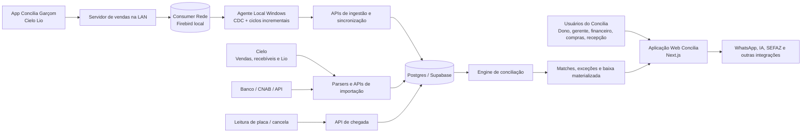
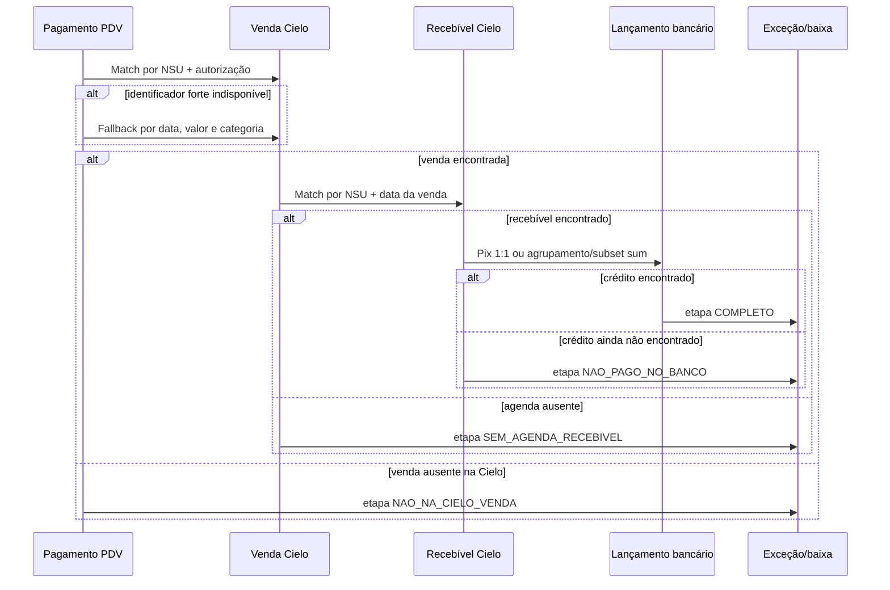

# Arquitetura e Mapeamento do Sistema Concilia

> **Repositório:** `prainhatur-lang/prainha`  
> **Branch:** `main`  
> **Data do levantamento:** 18 de agosto de 2026  
> **Status:** documentação técnica do estado atual, obtida por leitura do código-fonte  
> **Responsabilidade:** este documento descreve a arquitetura implementada; não substitui auditoria de segurança, homologação fiscal ou validação contábil.

## 1. Objetivo e escopo

Este documento consolida o mapa técnico e funcional do **Concilia**, sistema que começou como uma solução de conciliação financeira para restaurantes e evoluiu para uma plataforma operacional do Prainha Bar.

O levantamento cobre:

- arquitetura do monorepo;
- módulos de negócio e rotas de navegação;
- sincronização do Consumer/Firebird com a nuvem;
- conciliação PDV → Cielo → agenda de recebíveis → banco;
- conciliação de pagamentos que vão diretamente ao banco;
- tratamento de exceções, aceite, fechamento e materialização da baixa;
- modelo multiempresa e multifilial;
- autenticação e permissões;
- integrações externas e componentes locais;
- operação, observabilidade, riscos e pontos de evolução.

## 2. Resumo executivo

O Concilia é hoje uma plataforma **multi-tenant**, organizada pela hierarquia:

```text
organização → filial → dados operacionais e financeiros
```

Seu núcleo financeiro rastreia a cadeia completa de uma venda:

```text
Pagamento no Consumer
  → venda registrada pela Cielo
    → recebível agendado pela Cielo
      → crédito efetivamente encontrado no banco
```

O sistema combina cinco componentes principais:

1. **Aplicação web Next.js**, com dashboards, telas operacionais e APIs.
2. **Postgres/Supabase**, que mantém o estado central da aplicação.
3. **Pacote de conciliação**, com parsers e algoritmos determinísticos de matching.
4. **Agente local Windows**, que lê o Firebird do Consumer e envia alterações à nuvem.
5. **Componentes de borda**, como o app Cielo Lio, o agente de pátio e serviços locais usados no restaurante.

A arquitetura privilegia:

- correspondências fortes por identificadores transacionais;
- persistência dos matches para impedir reembaralhamento em novas execuções;
- matches fracos revogáveis quando surge evidência melhor;
- revisão humana em divergências e erros de classificação;
- isolamento obrigatório por filial;
- integrações locais em modo tolerante a falhas, sem bloquear o atendimento do restaurante.

### 2.1 Principal conclusão do levantamento

O código já implementa uma plataforma significativamente mais ampla do que o README original sugere. O README ainda apresenta fases importantes como pendentes, enquanto o repositório contém módulos de conciliação, compras, estoque, produção, reservas, folha, atendimento, avaliações, fiscal, delivery e integrações operacionais.

## 3. Mapa de capacidades de negócio

| Domínio | Capacidades implementadas | Principais áreas do código |
|---|---|---|
| Conciliação financeira | PDV × Cielo, venda × recebível, recebível × banco, PDV direto × banco, cross-route, exceções, aceite, fechamento | `packages/conciliador`, `apps/web/src/lib/conciliacao-*.ts`, `apps/web/src/app/api/conciliacao`, `packages/db/src/schema/conciliacao.ts` |
| Integração Consumer | CDC, checkpoint incremental, fila local, mapeamento Firebird → Postgres, comandos remotos | `agente-local`, `apps/web/src/app/api/concilia/sync`, `apps/web/src/lib/concilia-mappers.ts` |
| Financeiro | Contas a pagar/receber, plano de contas, caixa, DRE, fluxo de caixa, fechamento mensal | `packages/db/src/schema/financeiro.ts`, `apps/web/src/app/financeiro`, `apps/web/src/app/relatorios` |
| Compras | Sugestão, cotação, pedidos, recebimento de NF, conciliação produto × fornecedor | `packages/db/src/schema/compras.ts`, `packages/db/src/schema/cotacao.ts`, `apps/web/src/app/compras` |
| Estoque e produção | Produtos, variantes, fichas, movimentos, insumos, ordens de produção, perdas | `packages/db/src/schema/estoque.ts`, `produto_variante.ts`, `apps/web/src/app/estoque`, `apps/web/src/app/producao` |
| Reservas e eventos | Agenda, mesas, áreas, turnos, lista de espera, orçamentos e chegada por placa | `reserva.ts`, `lista-espera.ts`, `orcamento.ts`, `patio.ts`, `apps/web/src/app/reservas` |
| Atendimento e relacionamento | Conversas da Nina, leads de eventos, avaliações e contatos | `atendimento.ts`, `avaliacao.ts`, `apps/web/src/app/atendimento`, `apps/web/src/app/avaliacoes` |
| Folha e pessoas | Folha semanal, colaboradores, configurações e banco de talentos | `folha.ts`, `talento.ts`, `apps/web/src/app/folha`, `apps/web/src/app/talentos` |
| Delivery e venda digital | Pedidos, cardápio, cupons, taxas, endereços, iFood e MenuDino | `delivery-online.ts`, `consumer_operacional.ts`, `apps/web/src/app/delivery`, mappers de integração |
| Fiscal | NF-e/NFC-e, certificados, séries, itens, pagamentos e configuração fiscal | `notas.ts`, `nf_venda.ts`, `nfce.ts`, `certificados.ts`, APIs fiscais |
| Administração | Filiais, usuários, grupos, permissões, diagnóstico, sincronização e configurações | `tenant.ts`, `permissao.ts`, `/configuracoes`, `/usuarios`, `/grupos` |
| Operação no salão | Mesas, comandas, cobrança, app de garçom na Lio e recebimento na mesa | `lio-app`, `vendas-local`, `cobranca-mesa.ts`, APIs operacionais |

## 4. Contexto do sistema



### 4.1 Fronteiras de responsabilidade

**Consumer/Firebird**

- Continua sendo a origem operacional de pedidos, itens, pagamentos, contatos, caixa, estoque e várias tabelas fiscais.
- Não é consultado diretamente pelos usuários web; os dados são replicados para a nuvem.

**Agente local**

- Faz a ponte entre a rede da filial e a aplicação em nuvem.
- Executa sincronização incremental e CDC.
- Usa token próprio da filial.
- Opera como serviço Windows e mantém checkpoint local.

**Aplicação web**

- Centraliza APIs, regras de aplicação, dashboards e operações administrativas.
- Executa as orquestrações de conciliação.
- Aplica autenticação, acesso por filial e permissões.

**Pacote `@concilia/conciliador`**

- Mantém regras puras de parsing e matching.
- Deve permanecer independente da interface e, sempre que possível, do banco.

**Postgres/Supabase**

- Armazena dados replicados, configurações, matches, exceções, fechamentos e resultados materializados.
- É o ponto de integração entre os módulos web e os motores de conciliação.

## 5. Arquitetura do monorepo

```text
prainha/
├── apps/
│   └── web/                         # Next.js: páginas, APIs e regras de aplicação
├── packages/
│   ├── db/                          # Drizzle: schemas, cliente e migrations
│   ├── conciliador/                 # Parsers e motores de matching
│   └── shared/                      # Tipos e utilitários compartilhados
├── agente-local/                    # Serviço Windows conectado ao Firebird
├── agente-patio/                    # Integração local de placa/cancela com reservas
├── lio-app/                         # App Android para terminal Cielo Lio
├── vendas-local/                    # Backend operacional na LAN usado pela Lio
├── docs/                            # Documentação e especificações
├── scripts/                         # Rotinas administrativas e operacionais
├── pnpm-workspace.yaml
├── turbo.json
└── package.json
```

### 5.1 Dependências principais

- **Runtime web:** Next.js 16, React 19 e TypeScript.
- **Banco e ORM:** Postgres/Supabase e Drizzle ORM.
- **Autenticação:** Supabase Auth.
- **Validação:** Zod.
- **Conciliação:** parsers próprios, matching determinístico e subset sum.
- **Arquivos:** XLSX, XML e formatos Cielo/CNAB.
- **IA:** SDK da OpenAI em funcionalidades específicas do sistema.
- **Monorepo:** pnpm e Turborepo.
- **Agente local:** Node.js, `node-firebird` e NSSM no Windows.
- **Lio:** Android/Kotlin e SDK Cielo Order Manager.

## 6. Núcleo da conciliação financeira

### 6.1 Classificação por canal de liquidação

Cada forma de pagamento do Consumer é classificada por filial em um dos canais:

| Canal | Fluxo esperado | Exemplos |
|---|---|---|
| `ADQUIRENTE` | PDV → Cielo → recebível → banco | crédito, débito, Pix da maquininha, voucher adquirido |
| `DIRETO` | PDV → banco | Pix manual, TED, DOC ou transferência direta |
| `CAIXA` | PDV → conferência de caixa | dinheiro |
| `INTERNA` | PDV → conta interna | fiado, vale-funcionário e equivalentes |

O mapeamento é mantido em `forma_pagamento_canal`, por `filial_id + forma_pagamento`. O agente ou a aplicação pode sugerir uma classificação, mas o usuário pode confirmá-la ou corrigi-la.

Essa decisão é crítica: ela define qual motor recebe o pagamento. Erros de classificação são tratados pelo mecanismo **cross-route**.

### 6.2 Cadeia principal



### 6.3 Perna 1 — PDV × venda Cielo

**Cascata de matching**

| Nível | Evidência | Comportamento |
|---:|---|---|
| 1 | NSU + autorização | Match forte e persistente |
| 2 | NSU único ou desambiguado | Match de alta confiança |
| 3 | Data exata + valor exato + categoria da forma | Match automático firme |
| 4 | Proximidade com divergência controlada | Revisão/registro de divergência |
| 5 | Data próxima ou tolerância de valor | Match automático revogável |

### 6.4 Perna 2 — venda Cielo × agenda de recebíveis

A associação usa NSU e data da venda, pois NSU isolado pode ser reciclado.

### 6.5 Perna 3 — recebível × banco

Estratégia identificada:

- recebíveis agrupados por data prevista e tipo;
- PIX conciliado individualmente por valor antes dos agrupamentos;
- cartões conciliados por soma de créditos;
- `subset sum` para localizar combinações de lançamentos bancários;
- janela de datas progressiva para fins de semana, feriados e atrasos;
- realocação de combinações para reduzir matches gulosos incorretos;
- reconhecimento de descrições tanto de CNAB quanto da API do Banco.

### 6.6 Orquestração automática

O fluxo executa: `OPERADORA → RECEBIVEIS → BANCO → MATERIALIZAÇÃO`

Estados materializados da cadeia:

| Estado | Significado |
|---|---|
| `COMPLETO` | venda encontrada, agenda encontrada e crédito conciliado |
| `NAO_NA_CIELO_VENDA` | pagamento do PDV não localizado nas vendas da operadora |
| `SEM_AGENDA_RECEBIVEL` | venda localizada, mas sem recebível correspondente |
| `NAO_PAGO_NO_BANCO` | recebível existente, mas crédito não localizado no banco |
| `DIVERGENCIA_VALOR` | evidências associadas, porém com diferença que requer tratamento |

## 7. Sincronização Consumer/Firebird

### 7.1 Arquitetura do CDC

```mermaid
flowchart LR
    FB[(Consumer Firebird)] --> TRG[Triggers TR_CONCILIA_*]
    TRG --> Q[(CONCILIA_SYNC_QUEUE)]
    Q --> D[Agente local: drenador]
    D -->|batch + Bearer da filial| S[/api/concilia/sync]
    S --> M[concilia-mappers]
    M --> PG[(Postgres)]
    PG --> UI[Dashboards e motores]
```

O agente instala:
- tabela `CONCILIA_SYNC_QUEUE`;
- generator da fila;
- triggers após insert, update e delete;
- índices e estruturas auxiliares.

As triggers usam tratamento de exceção para que uma falha no CDC **nunca bloqueie o Consumer**. Isso protege a operação do restaurante, mas exige monitoramento da fila e do agente.

### 7.2 Endpoint de sincronização

```text
POST /api/concilia/sync
Authorization: Bearer <token-da-filial>
```

O endpoint:
- autentica o token contra a filial;
- valida até 5.000 registros por requisição;
- atualiza o heartbeat da filial;
- despacha cada registro ao mapper da tabela;
- retorna contadores de sucesso, não implementados e erros.

### 7.3 Mappers Consumer → Postgres

`apps/web/src/lib/concilia-mappers.ts` centraliza a tradução de cada tabela.

Responsabilidades:
- normalização de número, string, boolean e data;
- conversão para os tipos esperados pelo Drizzle;
- upsert por filial e código externo;
- soft delete ou delete conforme o domínio;
- resolução posterior de FKs;
- preservação de campos enriquecidos na nuvem quando o Consumer envia valores vazios.

Tabelas sem mapper retornam `nao_implementado`. O agente pode marcar o item como processado para evitar loop infinito. Essa decisão deve ser acompanhada por métricas.

## 8. Autenticação, autorização e isolamento

### 8.1 Autenticação

A aplicação usa Supabase Auth. Guards server-side recuperam o usuário por sessão antes de executar páginas e APIs protegidas.

### 8.2 Autorização

Funções centrais:

- `exigirPermPage(codigo)`;
- `exigirPermApi(codigo)`;
- `negarSemPerm(userId, codigo)`;
- `exigirAlgumaPermApi(codigos)`.

Checklist obrigatório para novas APIs:

1. autenticar usuário;
2. validar body com Zod;
3. validar permissão funcional;
4. validar acesso à filial;
5. filtrar todas as queries por `filialId`;
6. registrar auditoria quando houver decisão financeira ou administrativa.

### 8.3 Multi-tenancy

A regra estrutural é:

```text
organização
  └── filial
       ├── pagamentos
       ├── vendas adquirente
       ├── recebíveis
       ├── lançamentos bancários
       └── demais dados
```

Toda consulta de negócio deve restringir explicitamente o `filialId`. O acesso do usuário à filial é mantido por `usuario_filial`.

## 9. Integrações externas

| Integração | Papel no sistema |
|---|---|
| Consumer Rede / Firebird | PDV e fonte operacional local |
| Cielo EDI | vendas e agenda de recebíveis |
| Cielo Lio | venda e pagamento na mesa |
| Banco / CNAB 240 | extrato e conciliação bancária |
| Supabase | Postgres e autenticação |
| Vercel | hospedagem da aplicação web |
| WhatsApp | confirmação, comunicação e atendimento |
| OpenAI | recursos de IA |
| SEFAZ | emissão e consulta fiscal |
| iFood/MenuDino | pedidos e integração de delivery |

## 10. Datas, timezone e períodos

O domínio usa horário de Brasília, normalmente com construção explícita de datas em `-03:00`.

Riscos comuns:
- conversão automática para UTC alterar o dia da operação;
- venda perto da meia-noite aparecer no arquivo da Cielo no dia seguinte;
- recebível liquidado após fim de semana/feriado;
- ordenação lexicográfica incorreta de datas `DD/MM/YYYY`.

Práticas observadas:
- helpers de data em `apps/web/src/lib/datas.ts`;
- conversões explícitas BRT ↔ ISO;
- ampliação de janelas de matching;
- ordenação cronológica após normalização para `YYYY-MM-DD`.

## 11. Operação e observabilidade

### 11.1 Sinais existentes

- `ultimo_ping` por filial;
- logs diários do agente local;
- `boot-trace.log`, stdout e stderr do serviço;
- checkpoint de sincronização;
- tentativas e erro na fila CDC;
- histórico em `execucao_conciliacao`;
- exceções abertas e aceitas;
- datas de fechamento.

### 11.2 Indicadores recomendados

| Indicador | Objetivo |
|---|---|
| tempo desde o último ping por filial | detectar agente offline |
| tamanho e idade da fila CDC | detectar atraso de replicação |
| taxa de `nao_implementado` por tabela | detectar perda silenciosa de dados |
| erros de mapper por tabela | priorizar correções de contrato |
| percentual de match por nível | medir qualidade das chaves transacionais |
| quantidade e valor por tipo de exceção | medir risco financeiro |
| matches revogáveis em aberto | medir incerteza da conciliação |
| tempo entre recebível previsto e crédito | monitorar adquirente/banco |
| execuções com erro ou longa duração | monitorar estabilidade da orquestração |

## 12. Riscos e dívida técnica

### P0 — prioridade imediata

**Revisão da exposição do repositório público**

O repositório é público e contém topologia operacional, runbooks, paths locais e identificadores públicos duradouros.

**Garantia automática de RLS e isolamento por filial**

O sistema concentra dados financeiros, pessoais, fiscais e trabalhistas.

**Matriz de autenticação das APIs**

A quantidade de famílias de API é grande e os mecanismos de autenticação variam.

### P1 — alta prioridade

**Conflito no processo de migrations**

README, scripts expostos e runbook interno não descrevem o mesmo procedimento.

**CI sem execução automática de testes**

Typecheck, lint e build são úteis, mas não validam regras financeiras.

**Artefatos gerados no Git**

Bundles, ZIPs e CSVs aumentam peso, ruído e risco de exposição.

**Documentação desatualizada**

O README descreve essencialmente conciliação e um roadmap antigo, enquanto o produto já possui muitos outros módulos.

## 13. Componentes operacionais

### 13.1 App Concilia Garçom — Cielo Lio

O diretório `lio-app` contém um app Android/Kotlin para terminais Cielo Lio V3/DX8000.

Fluxo:
```text
garçom abre mesa
  → lança itens
    → consulta conta ao vivo
      → recebe no terminal
        → SDK Cielo retorna NSU/autorização/bandeira
          → servidor local baixa no Consumer
            → agente sincroniza
              → match nível 1 no Concilia
```

### 13.2 Servidor local de vendas

O app Lio depende de um servidor HTTP na LAN para:
- autenticar garçom;
- consultar mesas e cardápio;
- lançar itens;
- registrar pagamento;
- deduplicar transações;
- escrever no Firebird do Consumer.

Esse componente é uma fronteira operacional crítica: indisponibilidade local não deve perder pagamento já aprovado.

### 13.3 Agente de pátio

O agente de pátio envia a placa detectada para `/api/patio/chegada`.

A integração é **best effort** e não bloqueia a cancela.

## 14. Checklist de desenvolvimento

### 14.1 Nova funcionalidade web

- [ ] definir domínio e filial de escopo;
- [ ] criar/alterar schema e migration;
- [ ] validar inputs com Zod;
- [ ] aplicar autenticação e permissão server-side;
- [ ] validar acesso à filial;
- [ ] criar auditoria para decisões sensíveis;
- [ ] tratar timezone com helpers existentes;
- [ ] criar testes;
- [ ] atualizar menu e documentação.

### 14.2 Nova fonte de dados Consumer

- [ ] incluir tabela no CDC;
- [ ] definir estratégia de backfill;
- [ ] criar mapper;
- [ ] definir insert/update/delete;
- [ ] resolver FKs;
- [ ] garantir idempotência;
- [ ] criar fixture de teste;
- [ ] validar volume e tamanho de lote;
- [ ] monitorar `nao_implementado` e erros.

### 14.3 Nova regra de conciliação

- [ ] declarar evidência forte e fraca;
- [ ] definir nível e revogabilidade;
- [ ] preservar matches manuais;
- [ ] garantir 1:1 ou documentar cardinalidade distinta;
- [ ] garantir ordenação determinística;
- [ ] definir exceção e severidade;
- [ ] definir comportamento em dia fechado;
- [ ] atualizar materialização;
- [ ] adicionar cenários de regressão.

## 15. Glossário

| Termo | Definição |
|---|---|
| Consumer | PDV local da Consumer Rede, com banco Firebird |
| PDV | ponto de venda; no sistema, origem de pedidos e pagamentos |
| Cielo03 | arquivo/visão de vendas da Cielo |
| Cielo04 | arquivo/visão de recebíveis/agenda da Cielo |
| NSU | identificador da transação na adquirente |
| Autorização | código de autorização da transação de cartão/Pix na adquirente |
| Recebível | valor que a adquirente agenda para pagar ao estabelecimento |
| Match firme | relação que não deve ser automaticamente alterada |
| Match revogável | relação fraca que pode ser substituída por evidência melhor |
| Exceção | divergência ou ausência que exige análise humana |
| Fechamento | trava histórica de um dia/processo/filial |
| CDC | captura de alterações por triggers no Firebird |
| Mapper | tradução de uma linha Consumer para o schema Postgres |
| Filial | unidade operacional e fronteira principal de isolamento dos dados |

---

## Regra de atualização deste documento

Atualize esta documentação quando ocorrer qualquer um destes eventos:

- criação ou remoção de domínio no menu;
- inclusão de nova fonte de dados;
- mudança na cascata de matching;
- criação de novo estado de conciliação;
- alteração de contrato entre nuvem e agente/local;
- mudança de estratégia de autenticação ou permissão;
- adoção de novo banco, adquirente ou canal de pagamento;
- alteração relevante no deploy ou operação.

Toda mudança arquitetural relevante deve incluir no mesmo PR:

1. alteração de código;
2. teste correspondente;
3. atualização deste documento ou criação de ADR.
